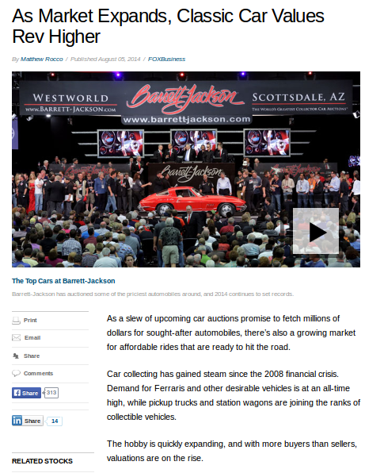
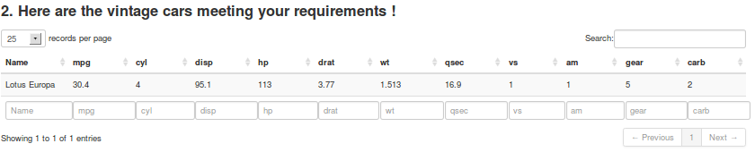

## Demand for vintage cars booming
- Maybe a good time to start a vintage cars business
- Have built an App for this based on ```mtcars``` dataset
http://www.foxbusiness.com/industries/2014/08/05/as-market-expands-classic-car-values-rev-higher/


---

## The Vintage cars selector

This is what the App looks like (Image courtesy http://www.anythingaboutcars.com/1960s-cars.html)


--- &twocol

## How the App works

***=left


***=right
* This is the user input interface 
* Based on the user choices, the App picks a subset of ```mtcars``` satisfying the criteria and displays it as a table along with the car name(s)
* App is available at https://vaidyts.shinyapps.io/vintagecars/

---

## Illustration of the code
* Suppose the buyer wants to buy a manual transmission vintage car, with mileage between 30-40 mpg, 4-8 cylinders, displacement 50-500cc, horse power 100-250 Bhp, and 4-8 gears. Below is an illustration of what the code does - it performs a simple subsetting and displays the results
```{r}
data(mtcars)
chkauto <- 0;           chkman <- 1;                mpgrange <- c(30,40);
cylrange <- c(4,8);     disprange <- c(50,500);     hprange <- c(100,250);      gearrange <- c(4,8);
mtcars[ ( (mtcars$mpg  >= mpgrange[[1]])  & (mtcars$mpg <= mpgrange[[2]])  &
            (mtcars$cyl  >= cylrange[[1]])  & (mtcars$cyl <= cylrange[[2]])  &
            (mtcars$disp >= disprange[[1]]) & (mtcars$disp <= disprange[[2]]) &
            (mtcars$hp   >= hprange[[1]])   & (mtcars$hp <= hprange[[2]])   &
            (mtcars$gear >= gearrange[[1]]) & (mtcars$gear <= gearrange[[2]]) &
            (chkauto*(mtcars$am == !(chkauto)) | chkman*(mtcars$am == chkman)) ), ]
```

